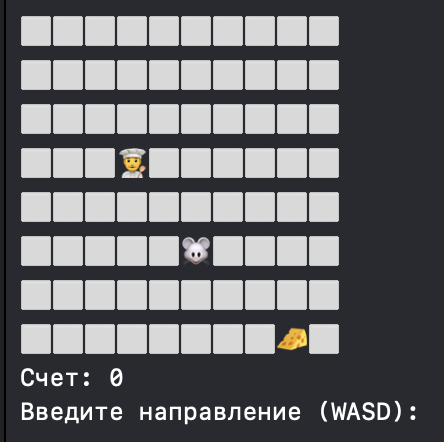
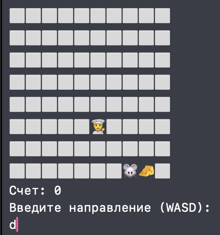
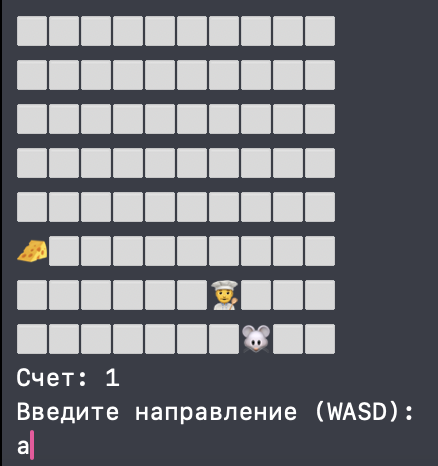
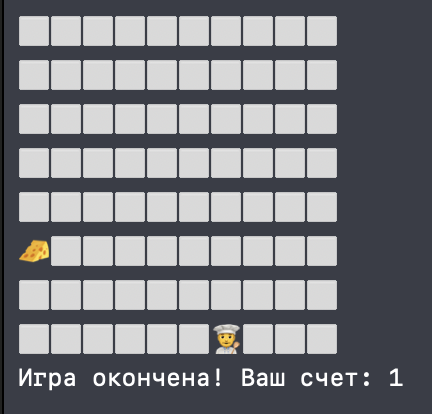

# 🐭 Mouse & Cheese 🧀: Console Game

Учебный проект по Swift, преобразованный в мини-игру с поваром, мышкой и сыром. 
Разработано в рамках домашнего задания курса по Swift от Алексея Скутаренко.

## 🖼 Скриншоты
| Начало игры | Путь к первому сыру | Путь ко второму сыру | Завершение игры |
|-------------|---------------------|----------------------|-----------------|
|  |  |  |  |

## 🎮 Суть игры
- Игрок управляет мышкой (`🐭`) с помощью клавиш WASD
- Нужно собирать сыр (`🧀`), избегая повара (`👨‍🍳`)
- За каждый сыр начисляются очки
- Игра заканчивается, когда повар ловит мышку

## 🛠 Технологии
- Чистый Swift (без UIKit/SwiftUI)
- Консольный ввод/вывод
- ООП (структуры, enum, методы)
- Принципы игрового цикла

## 📦 Установка
1. Клонируйте репозиторий:
```bash
git clone https://github.com/MariaChernokoz/Mouse-Cheese-Console-Game
